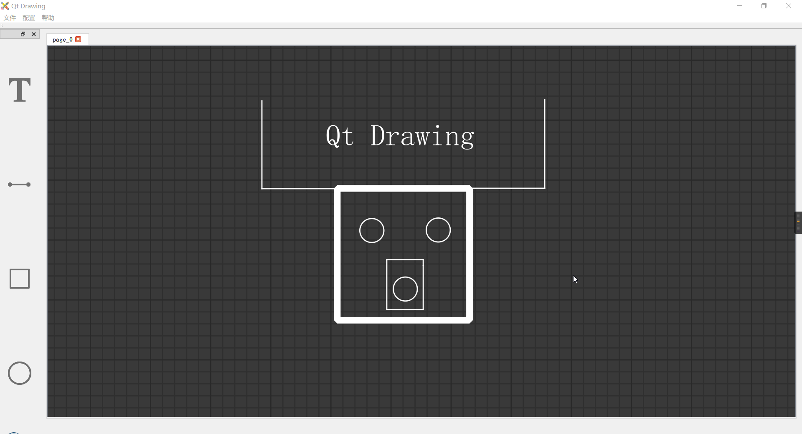

# Qt Drawing
新版本请查看仓库[ydyodraw](https://github.com/yunke120/ydyodraw.git)
## Introduction

​		基于Qt软件开发的绘图软件，其具有以下功能：

- [x] 图元的添加、删除、移动、旋转、放缩等
- [x] 视图的拖动放大
- [x] 图元的连接
- [x] 图纸打印（图片和 PDF）
- [x] 配置导出与导入

## Optimizing

​		待优化功能

- [x] 图元的移动应该以像素为单位
- [x] 图元的放缩致使画笔也应该随之变化
- [ ] 图元移动时，连线也跟随移动
- [ ] 图元属性页
- [x] 设计暗黑和明亮两种界面样式

## Objects

​		**基础图元**

- [x] 字 (Text)
- [x] 线 (Line)
- [x] 矩形 (Rect)
- [x] 椭圆 (Ellipse)
- [ ] 箭头 (Arrow)

## How2Use

### Shortcuts

| 快捷键   | 功能              |
| -------- | ----------------- |
| ↑        | 向上微调图元      |
| ↓        | 向下微调图元      |
| ←        | 向左微调图元      |
| →        | 向右微调图元      |
| Ctrl + ↑ | 放大图元          |
| Ctrl + ↓ | 缩小图元          |
| Ctrl + ← | 逆时针微调图元    |
| Ctrl + → | 顺时针微调图元    |
| Space    | 顺时针90°旋转图元 |

## Problems

1.  添加图元并移动后，拖曳视图，鼠标不会变成手型； 
2.  鼠标在图元里面时，删除图元，鼠标不会变成箭头型
3.  导出的图片有点糊

## Interface

